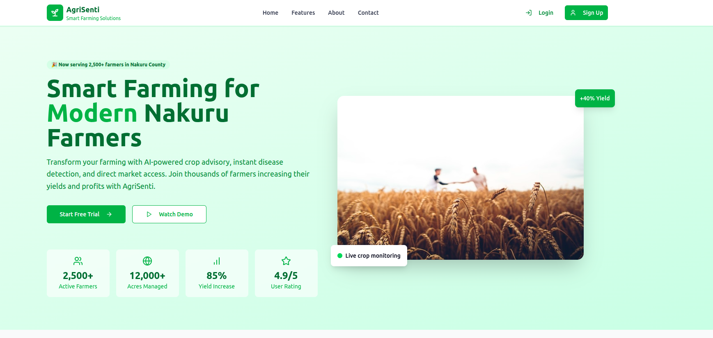

# AgriSenti WebApp



## Project Overview

AgriSenti is a comprehensive agricultural assistance web application designed for farmers across Kenya. The platform leverages modern technology to address key challenges faced by local farmers, including limited access to agricultural expertise, difficulty in identifying crop diseases, and lack of market information.

Developed to bridge the information gap in Kenya's agricultural sector, AgriSenti integrates multiple tools that help farmers optimize their agricultural practices, monitor crop health in real-time, track market prices for better decision-making, and receive personalized farming recommendations based on local conditions. The application is designed with a user-friendly interface that considers the varying technical literacy levels of farmers in the region.

## Features

### Crop Assistant

An AI-powered virtual agricultural expert that provides:

- **Personalized Farming Advice**: Tailored recommendations based on Kenya's diverse soil conditions, climate patterns, and regional agricultural practices
- **Crop Management Guidance**: Step-by-step instructions for optimal crop care throughout the growing season
- **Planting Schedules**: Customized planting calendars accounting for Kenya's diverse rainfall patterns across different regions
- **Fertilizer Recommendations**: Soil-specific fertilizer advice to maximize yields while minimizing environmental impact
- **Pest Management Strategies**: Integrated pest management techniques focusing on sustainable and affordable solutions
- **Natural Language Interface**: Supports conversations in English and Swahili for maximum accessibility

### Disease Detection

A sophisticated plant health monitoring system that:

- **Analyzes Crop Images**: Uses computer vision algorithms to process uploaded photos of plant leaves, stems, and fruits
- **Identifies 20+ Common Diseases**: Accurately detects prevalent diseases affecting maize, beans, potatoes, tea, coffee, sugarcane, and other Kenyan staple crops
- **Diagnoses Nutrient Deficiencies**: Recognizes visual symptoms of specific mineral deficiencies in plants
- **Provides Treatment Protocols**: Offers detailed, actionable treatment plans with both organic and conventional options
- **Suggests Preventive Measures**: Recommends practices to avoid recurrence and spread
- **Works Offline**: Core detection capabilities function without internet connection for remote farm use

### Market Dashboard

A comprehensive market intelligence platform that:

- **Tracks Real-Time Crop Prices**: Monitors current selling prices across Kenya's major agricultural markets
- **Analyzes Price Trends**: Visualizes historical price data with interactive charts to identify optimal selling periods
- **Connects to Verified Buyers**: Provides direct links to pre-vetted agricultural buyers and processing companies
- **Displays Quality Requirements**: Shows specific quality standards required by different buyers
- **Features Market Forecasts**: Predicts price movements based on historical patterns and current market conditions
- **Enables Direct Messaging**: Allows farmers to communicate with buyers through the platform

### Weather Monitoring

A specialized agricultural weather system that:

- **Provides Hyperlocal Forecasts**: Offers micro-climate predictions specific to Kenya's diverse topography and climate zones
- **Issues Early Weather Alerts**: Warns about incoming weather events that could impact farming operations
- **Tracks Seasonal Patterns**: Analyzes rainfall distribution and temperature trends throughout the year
- **Includes Agricultural Interpretation**: Translates weather data into specific farming recommendations
- **Monitors Soil Moisture**: Integrates data from local weather stations to estimate field conditions
- **Offers Climate-Smart Guidance**: Suggests adaptive measures in response to changing climate patterns

### Interactive Maps

A geospatial information system that:

- **Visualizes Agricultural Data**: Maps out crop distribution, yield potential, and land utilization across Kenya's 47 counties
- **Locates Market Centers**: Shows the positions of trading centers with information on market days and specializations
- **Identifies Extension Services**: Pinpoints locations of agricultural extension offices and input suppliers
- **Maps Water Resources**: Displays water points, irrigation schemes, and water conservation structures
- **Shows Infrastructure Access**: Highlights road networks and transportation options for market access
- **Features Land Suitability Analysis**: Color-coded maps indicating optimal areas for different crop varieties

## Technologies Used

### Frontend

- **React (18.3+)**: A JavaScript library for building dynamic user interfaces with component-based architecture
- **TypeScript (5.5+)**: Enhances development with strong typing, better IDE support, and reduced runtime errors
- **Vite (5.4+)**: Modern build tool offering lightning-fast HMR (Hot Module Replacement) and optimized production builds
- **Tailwind CSS (3.4+)**: Utility-first CSS framework for rapidly building custom designs without leaving HTML
- **shadcn/ui**: A collection of accessible and customizable components built on Radix UI primitives
- **React Router Dom (6.26+)**: Declarative routing for React applications with support for dynamic route matching
- **Recharts (2.12+)**: Composable charting library built on React components for responsive data visualization
- **Lucide React**: A library of simply beautiful open source icons for consistent visual elements

### State Management & Data Fetching

- **React Query (TanStack Query 5.56+)**: Data fetching, caching, and state management library for asynchronous operations
- **React Hook Form (7.53+)**: Performance-focused form validation library with minimal re-renders
- **Zod (3.23+)**: TypeScript-first schema validation with static type inference for robust data validation

### Backend Integration

- **Supabase (2.49+)**: Open-source Firebase alternative providing:
  - PostgreSQL database with powerful querying capabilities
  - Built-in authentication with multiple providers
  - Storage for images and files with fine-grained access control
  - Edge functions for serverless backend operations
  - Real-time subscriptions for live data updates

### Maps and Visualization

- **Google Maps API**: Interactive, customizable maps with extensive features including:
  - High-performance map rendering
  - Custom styles and data visualization
  - Geocoding and geolocation services

## Feature Images

All feature images are sourced from Unsplash, optimized for performance and consistency:

### AI Crop Assistant Feature

- **Source**: [Unsplash Photo by Gabriel Jimenez](https://images.unsplash.com/photo-1574943320219-553eb213f72d)
- **Dimensions**: 800x600px (cropped)

### Disease Detection Feature

- **Source**: [Unsplash Photo by Ales Krivec](https://images.unsplash.com/photo-1416879595882-3373a0480b5b)
- **Dimensions**: 800x600px (cropped)

### Market Intelligence Feature

- **Source**: [Unsplash Photo by Carlos Muza](https://images.unsplash.com/photo-1460925895917-afdab827c52f)
- **Dimensions**: 800x600px (cropped)

### Risk Management Feature

- **Source**: [Unsplash Photo by NOAA](https://images.unsplash.com/photo-1586771107445-d3ca888129ff)
- **Dimensions**: 800x600px (cropped)

### Mobile First Feature

- **Source**: [Unsplash Photo by Rahul Chakraborty](https://images.unsplash.com/photo-1512941937669-90a1b58e7e9c)
- **Dimensions**: 800x600px (cropped)

### Community Support Feature

- **Source**: [Unsplash Photo by Annie Spratt](https://images.unsplash.com/photo-1542601906990-b4d3fb778b09)
- **Dimensions**: 800x600px (cropped)

All images are licensed under the Unsplash License and are free to use for both personal and commercial purposes.

## System Architecture

AgriSenti follows a modern client-server architecture designed for scalability and offline capability:

### Client-Side Architecture

- **Single Page Application (SPA)**: Built with React for smooth navigation without full page reloads
- **Responsive Design**: Mobile-first approach with adaptive layouts for all device sizes
- **Progressive Web App (PWA)**: Service workers enable offline functionality and improved performance
- **Local Storage**: Caches critical data for areas with intermittent connectivity
- **Lazy Loading**: Optimizes initial load time by only loading necessary components

### Server-Side Architecture

- **Serverless Backend**: Leverages Supabase for authentication, database, and storage
- **Edge Functions**: Processes data close to the user for reduced latency
- **Real-time Subscriptions**: Enables live updates for market prices and weather alerts
- **Microservices**: Modular API endpoints for disease detection, weather forecasts, and market data

## Getting Started

### Prerequisites

- **Node.js**: v18.0.0 or later (v20+ recommended for best performance)
- **Package Manager**: npm v9+ or Bun v1.0.2+
- **Supabase Account**: Free tier sufficient for development
- **Google Maps API Key**: Required for map functionality

### Development Environment Setup

```sh
# Step 1: Clone the repository
git clone https://github.com/yourusername/agri-senti-webapp.git

# Step 2: Navigate to the project directory
cd agri-senti-webapp

# Step 3: Install dependencies
npm install
# or if using Bun for faster installation
bun install

# Step 4: Create environment configuration file
cp .env.example .env.local

# Step 5: Fill in required environment variables in .env.local
# - Add your Supabase URL and anon key
# - Add your Google Maps API key
# - Configure other optional services

# Step 6: Start the development server
npm run dev
# or
bun run dev
```sh
```

### Building for Production

```sh
# Generate optimized production build
npm run build

# Preview the production build locally
npm run preview
```

## Deployment Options

### Vercel Deployment (Recommended)

1. Fork this repository to your GitHub account
2. Connect your Vercel account to GitHub
3. Import the repository in Vercel dashboard
4. Configure environment variables
5. Deploy with default settings

### Traditional Hosting

1. Build the project: `npm run build`
2. Upload the contents of the `dist` folder to your web server
3. Configure your server to handle SPA routing (redirect 404s to index.html)

## Environment Configuration

Create a `.env.local` file in the root directory with the following variables:

```env
# Supabase Configuration
VITE_SUPABASE_URL=your_supabase_url
VITE_SUPABASE_ANON_KEY=your_supabase_anon_key

# Maps Configuration
VITE_GOOGLE_MAPS_API_KEY=your_google_maps_api_key

# API Configuration
VITE_API_BASE_URL=https://api.weatherapi.com/v1
VITE_WEATHER_API_KEY=b3526825bf6345ad829220441252605

# Feature Flags
VITE_ENABLE_OFFLINE_MODE=true
VITE_ENABLE_ANALYTICS=false
```

## Project Structure

```text
agri-senti-webapp/
├── public/               # Static assets
├── src/
│   ├── components/       # Reusable UI components
│   │   ├── ui/           # Base UI components from shadcn
│   │   └── ...           # Feature-specific components
│   ├── contexts/         # React context providers
│   ├── hooks/            # Custom React hooks
│   ├── integrations/     # Third-party service integrations
│   ├── lib/              # Utility functions and helpers
│   ├── pages/            # Page components
│   └── main.tsx          # Application entry point
├── .env.example          # Example environment variables
└── package.json          # Project dependencies and scripts
```

## Asset Management

The project includes various assets organized by type:

### Images

Located in `public/assets/images/`:

- **agri-banner.png** - Main banner for the AgriSenti application
- **crop-assistant.png** - Illustration for the Crop Assistant feature
- **disease-detection.png** - Illustration for the Disease Detection feature
- **market-dashboard.png** - Illustration for the Market Dashboard feature
- **weather-monitoring.png** - Illustration for the Weather Monitoring feature
- **interactive-maps.png** - Illustration for the Interactive Maps feature

### Team Member Images

Located in `public/assets/team/`:

- **team-member-1.png** - Photo of Fakii Mohammed (CEO)
- **team-member-2.png** - Andrew Ogembo (CTO) - Uses icon
- **team-member-3.png** - Chiboniso Nyoni (User Experience Lead) - Uses icon

### Icons

Located in `public/assets/icons/`:

- **agri-logo.png** - Official AgriSenti logo

### Root Assets

Located in the `public/` directory:

- **favicon.ico** - Website favicon based on the AgriSenti logo
- **agri.png** - Main AgriSenti logo image used for social media sharing

## Contributing

We welcome contributions to the AgriSenti project! Here's how you can help:

1. **Fork** the repository
2. **Create** a feature branch: `git checkout -b feature/amazing-feature`
3. **Commit** your changes: `git commit -m 'Add some amazing feature'`
4. **Push** to the branch: `git push origin feature/amazing-feature`
5. Submit a **Pull Request**

### Development Guidelines

- Follow the established code style and organization
- Write meaningful commit messages
- Include documentation for new features
- Add or update tests as needed
- Ensure all tests pass before submitting PR

## License

This project is licensed under the MIT License - see the [LICENSE](LICENSE) file for details.

## Acknowledgments

- **Kenya Agricultural and Livestock Research Organization (KALRO)** for domain expertise and data validation
- **Local Farmer Cooperatives** for user testing and feedback
- **Kenya Meteorological Department** for weather data integration
- **The Agriculture and Food Authority (AFA)** for market price data

## Meet Our Team

The AgriSenti project is developed and maintained by a dedicated team with expertise in educational technology, AI systems, and user experience design:

- **Fakii Mohammed** - CEO  
  Visionary leader with extensive experience in educational technology and family-centered solutions

- **Andrew Ogembo** - CTO  
  Technical architect specializing in AI systems and scalable educational platforms

- **Chiboniso Nyoni** - User Experience Lead  
  UX expert focused on creating intuitive, family-friendly interfaces that make learning accessible

Our diverse team brings together experience in educational technology, AI systems, user experience design, and family-centered solutions to create a platform that empowers farmers through accessible and intuitive technology.
